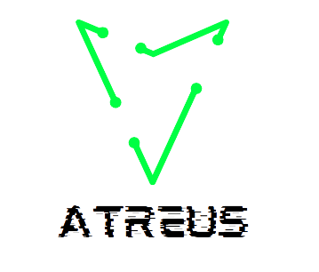

# Atreus

<div align="center" >
  

  


# Anti Ryuk Ransomware for Windows.
> [!WARNING]  
> ### Disclaimer: Not intended to be a production Counter Measure, only a good approach to identify and mitigate Ryuk actions.
</div>
<div align="center">
      <h2>Atreus in action</h2>
      <a href="https://www.youtube.com/watch?v=_PBWTkW-ZOk">
         
      </a>
</div>


## Build

> [!IMPORTANT]  
> To build Atreus you only need **Python 3.7>** installed and configured as an **environment variable**.

To Build Atreus, run the command below

```bash
setup.bat
```
> [!NOTE] 
> You can download the VM used in the the research and tests by the following [link](https://drive.google.com/file/d/1Pvok4Kl5M2Gw1HvcbEu9MRtYt_c5Gv2G/view?usp=sharing)


## [About Ryuk](ryuk_data)
Ryuk ransomware is a sophisticated and notorious strain of ransomware that emerged in August 2018. 
It is known for its highly targeted attacks on large organizations, especially in the corporate and financial sectors. 

Ryuk is believed to be operated by a cybercrime group known as Wizard Spider.
The primary purpose of Ryuk ransomware is to encrypt the victim's files, making them inaccessible. 

Once the files are encrypted, Ryuk displays a ransom note, typically in a "RyukReadMe.txt" file, containing instructions on how to pay the ransom to obtain the decryption key.
It has some typical behaviours analysed in this [research](www.google.com), such as:
* Multi-thread, calling CreateRemoteThread
* Process Injection through multiples process in the Machine
* AES256 encryption of files
* Envelope encryptation of each AES key inside the file with RSA1 key.
* Change of the registry keys using "svcho" for persistence
* Dropping it's executable in the "C:/Users/<user_name>/Public" folder

You can see more about Ryuk in the [ryuk_data](ryuk_data) folder, where you can see:
* **A report in portuguese about the analysis**
* Strings decoded and encoded in the dropper and payload;
* Ransom Note;
* Process Injection Routine in C++ used by Ryuk, discovered with Reverse Engineer with Xdbg64 and Snowman;
* Encryptation process, with data such as the Encryptation routine in C++ and ASM, the RSA1 key imported in my analysis and the CryptImportKey routine.

> [!WARNING]    
> The threat analysed here is [available in Malware Baazar](https://bazaar.abuse.ch/browse.php?search=sha256%3A23F8AA94FFB3C08A62735FE7FEE5799880A8F322CE1D55EC49A13A3F85312DB2). Don't execute it in your host. Create a sandbox VirtualMachine in **VirtualBox**, **Paralells** or **VMWare** and take care about the execution of this ransomware, such as:
> 
> * Do not connect any host network during the execution to avoid connection with C&C;
> * Keep the virtualizer software updated;
> * Use a host OS different of the virtualized (e.g Linux as Host, and Windows in VM) to mitigate possible evasion;

## How Atreus work

Atreus is a open-source anti-ransomware software specifically designed to protect against the notorious Ryuk ransomware. 

Ryuk is a highly targeted and dangerous strain of ransomware known for its devastating attacks on large organizations. 

Developed as a result of extensive undergraduate research at my university, Atreus aims to provide an additional layer of defense against Ryuk and its malicious activities.

> [!NOTE]  
> It uses the power of [Sysinternals](https://learn.microsoft.com/en-us/sysinternals/) to **monitor**, **trace**, **detail** and **list** informations about API's calls, processes and files all over the OS, facilitating the identification and mitigation of potentital Ryuks Threats.

<div align="center" >
  


</div>

### Key Features of Atreus Anti-Ransomware:

1. Detecting Suspicious "CreateRemoteThread" Calls:

      Atreus keeps a vigilant eye on system processes, especially monitoring for suspicious "CreateRemoteThread" calls. These calls are commonly associated with Ryuk's attempt to inject its malicious code into other processes, enabling the ransomware to spread and cause widespread damage. By identifying and alerting about such behavior, Atreus helps you detect and respond to potential Ryuk attacks early on.
<div align="center" >
  


</div>

2. Detecting Registry Changes for Persistence:

    Ryuk relies on modifying registry settings to maintain persistence on infected systems, ensuring that it remains active even after system reboots. Atreus is equipped with  monitoring capabilities that can detect and flag any unauthorized changes to critical registry entries, allowing you to identify potential ransomware activity and take immediate action.
<div align="center" >
  


</div>

3. Detecting Suspected Files with YARA Rules:

    Utilizing the power of YARA rules, Atreus employs customizable and intelligent pattern matching techniques to identify files that exhibit characteristics of Ryuk ransomware. These YARA rules are regularly updated to reflect the latest attack patterns and signatures used by Ryuk, ensuring a proactive defense against evolving threats.
  <div align="center" >
    


</div>

## References

* [SwiftOnSecurity-sysmon-config](https://github.com/SwiftOnSecurity/sysmon-config)
* [YJesus-AntiRansom](https://github.com/YJesus/AntiRansom)
